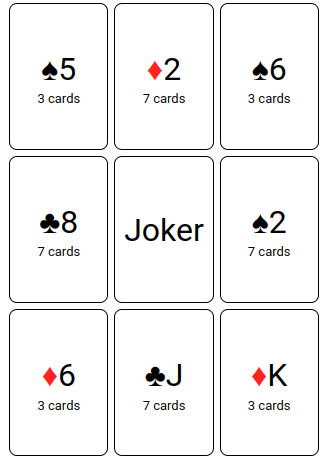

# JokerJailBreak

The purpose of this package is to simulate and play the game Joker Jail Break. Basic documentation for using the package is provided below.

# Rules 
Joker jail break is a simple card matching game developed by Ramon Huiskamp. The goal is to remove the Joker from the jail cell. As shown below, the Joker is placed the center of a 3 X 3 matrix of card piles which serves as a jail cell. The corners have 3 cards and the other piles have 7 cards. The Joker can breakout once either the top, bottom, left or right pile is depleted. Joker cannot escape from the corners, but cards in those piles can be used strategically.  

<center></center>

Cards are removed by selecting cards such that the sum of the black and sum of the red cards are equal. In some situations, a valid card selection does not exist. A card from the remaining deck can be placed on the Joker in an attempt to resolve the impasse. However, cards placed on the Joker must ultimately be removed, and a maximum of three cards can be placed on the Joker at any time. The game ends when Joker is free, or no moves are possible. An online version of Joker jail break can be found here: (https://wcordewiner.github.io/joker-jailbreak/)

# API

At minimum, the API requires one to define a subtype of `AbstractPlayer`, and a corresponding `decide` function. Here is an outline of a player:

```julia
struct Player <: AbstractPlayer
    # optional fields
end
```
Note that fields can be added as needed. The following code block shows the outline of the `decide` method, which returns two variables: `stop` which indicates whether the player stops the game, and `indices` which are the indices of the selected cards.

```julia
function decide(player::Player, board, card_counts, deck_size; kwargs...)
    # intentionally blank
    return stop,indices
end
```

After defining the player subtype and `decide` function, the game can be simulated by creating an instance of a game, the player, and passing them to `simulate!`. A minimal example is provided in the following section. 

Three other methods in API can be optionally defined. `setup` allows you to configure the player before starting the game. 

```julia
function setup!(player::Player, board, card_counts; kwargs...)
    # intentionally blank
    return nothing
end
```

By default, only the number of rounds and the outcome of the game are collected. However, JokerJailBreak.jl provides two methods for custom data collection during the simulation: `update_data_round`, which is called after each round, and `update_data_end` which is called after the game has finished. To define custom data collection, first define a custom data type (e.g., `MyData`), and define the methods below:

```julia
function update_data_round!(game, player, data::MyData, stop; kwargs...)

    return nothing
end
```

```julia
function update_data_end!(game, player, data:MyData, stop; kwargs...)

    return nothing
end
```

# Example

The following example illustrates how to develop a simple player. The first step is to use the required libraries. 

```julia
using JokerJailBreak
import JokerJailBreak: AbstractPlayer, decide
using StatsBase
using Random
```


Next, we will make a subtype of `AbstractPlayer` called `Player` so that we can extend the `decide` function. In practice, fields can be added to a subtype of `AbstractPlayer`, but it is not necessary for this example. 

```julia
struct Player <: AbstractPlayer

end
```

Now that we have defined our own subtype of `AbstractPlayer`, we can define the player's decision logic.
The player will select random pairs of cards until a match is found (e.g., 5 black, 5 red), or 1000 attemps have been made. If no matches are found, the player stops the game. The function `decide` will return two variables: `stop` which indicates whether the player stops the game, and `indices` which are the indices of the selected cards. The function `sample` from the package `StatsBase` will be used to sample pairs of card indices without replacement. 

```julia
function decide(player::Player, board, card_counts, deck_size)
    indices = Int[]
    cnt = 0
    while cnt < 1000 
        cnt += 1
        indices = sample(1:9, 2, replace=false)
        any(i -> board[i] == nothing, indices) ? continue : nothing
        is_zero_sum(board, indices) ? break : nothing
    end
    stop = cnt < 1000 ? false : true 
    cnt == 1000 ? empty!(indices) : nothing
    return stop,indices
end
```
The last steop is to simulate the game with `simulate!`. The default data object with a round count and outcome indicator (win, not_winnable) will be returned if a custom data type is not passed.

```julia 
game = Game()
player = Player()
simulate!(game, player)
``` 

One question you might want to answer is how often does this strategy solve the game? Let's wrap the code block above in a function.
```julia
function wrapper(;kwargs...)
    game = Game()
    player = Player()
    return simulate!(game, player; kwargs...)
end
```
Now, let's set the seed of the random number generator and repeat the simulation 1,000 times.
```julia
Random.seed!(210)
data = map(x -> wrapper(), 1:1000)
mean(x -> x.outcome == :win, data)
```
As expected, the win probability is low: `0.002`. 